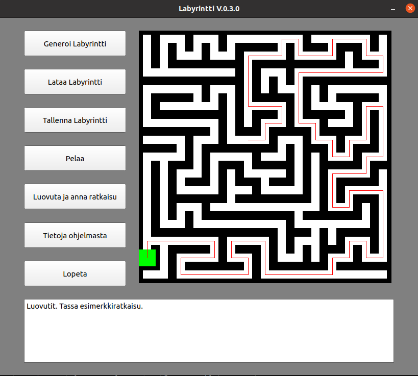

# Python Labyrintti
CSE-A1121 Ohjelmoinnin peruskurssin Y2 projektityö. Labyrinttipeli, joka käyttää PyQt5 kirjastoa.

## Kuvakaappaus




## Asennusohjeet (Ubuntu 20.04)

Asenna Python3

```
sudo apt-get install python3
sudo apt install python3-pip
```

Asenna PyQt5

```
pip3 install --user pyqt5  
sudo apt-get install python3-pyqt5  
sudo apt-get install pyqt5-dev-tools
sudo apt-get install qttools5-dev-tools
```

Lataa ja pura repo omalle koneellesi, ja käynnistä tämän jälkeen main.py tiedosto

```
git clone git@github.com:mevid93/PythonLabyrintti.git
cd PythonLabyrintti
python3 main.py
```
